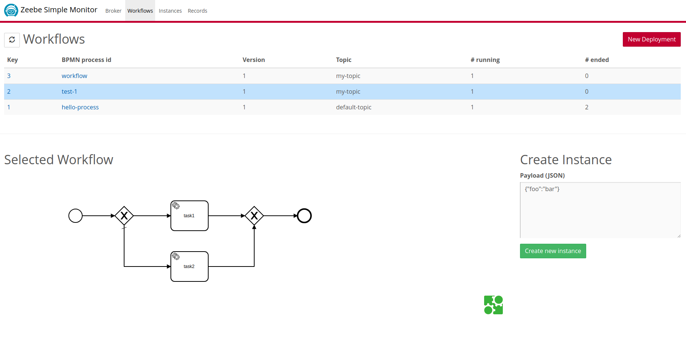
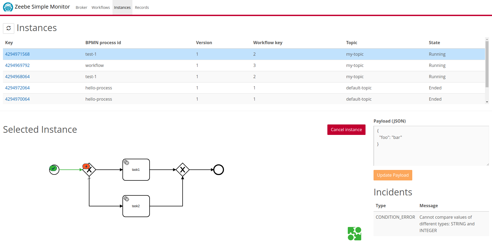

Zeebe Simple Monitor
=========================

This is a monitoring application for [Zeebe](https://zeebe.io). It has two parts: an [exporter](https://github.com/zeebe-io/zeebe-simple-monitor/exporter) and a [web application](https://github.com/zeebe-io/zeebe-simple-monitor/app). The exporter runs on the Zeebe broker and export data to a database. The webapp reads the data from the database and present it in a HTML5 web application.

**Features:**
* inspect deployed workflows
* inspect workflow instances, including payload and incidents
* management operations (e.g. new deployment, cancel workflow instance, update payload)

*This is a community project meant for playing around with Zeebe. It is not officially supported by the Zeebe Team (i.e. no gurantees). Everybody is invited to contribute!* 


## How to build

Build with Maven

`mvn clean install`

## How to run

Before you start the broker, copy the exporter JAR from the target folder into the lib folder of the broker.

```
cp exporter/target/zeebe-simple-monitor-exporter-%{VERSION}.jar ~/zeebe-broker-%{VERSION}/lib/
```

Register the exporter in the Zeebe configuration file `~/zeebe-broker-%{VERSION}/config/zeebe.cfg.toml`.

```
[[exporters]]
id = "simple-monitor"
className = "io.zeebe.monitor.SimpleMonitorExporter"
```

Now start the broker and the webapp

`java -jar app/target/zeebe-simple-monitor-app-{VERSION}.jar`

Open a web browser and go to http://localhost:8080

> The default configuration uses a file-based H2 database and works if the broker and the webapp runs on the same machine. See the [exporter](https://github.com/zeebe-io/zeebe-simple-monitor/tree/master/exporter#configure-the-exporter) and the [web application](https://github.com/zeebe-io/zeebe-simple-monitor/tree/master/app#configuration) for more configuration options.

## Impressions





## Code of Conduct

This project adheres to the Contributor Covenant [Code of
Conduct](/CODE_OF_CONDUCT.md). By participating, you are expected to uphold
this code. Please report unacceptable behavior to code-of-conduct@zeebe.io.

## License

[Apache License, Version 2.0](/LICENSE) 

[broker-core]: https://github.com/zeebe-io/zeebe/tree/master/broker-core
[agpl]: https://github.com/zeebe-io/zeebe/blob/master/GNU-AGPL-3.0
