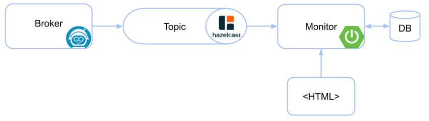
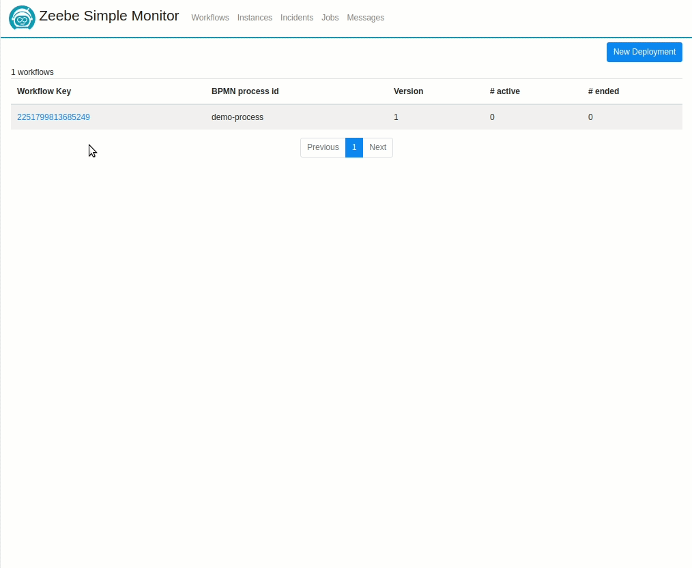

Zeebe Simple Monitor
=========================

A monitoring application for [Zeebe](https://zeebe.io). It is designed for developers to

* get in touch with Zeebe and workflow execution (BPMN)
* test workflows manually
* provide insides how workflows are executed 

The application imports the data from Zeebe using the [Hazelcast exporter](https://github.com/zeebe-io/zeebe-hazelcast-exporter). It aggregates the data and store it into a (in-memory) database. The data is display on server-side rendered HTML pages.



## Install

### Docker

The following command will build the project, pull images and start containers with default settings.

1. Run the following command in your terminal (in the root project folder):

    ```bash
    docker/run
    ```
    
    If you don't have the right to launch `docker/run` try:

    ```bash
    chmod +x docker/run
    ```
    
2. Go to http://localhost:8080

### Manually

1. Download the latest [Hazelcast exporter JAR](https://github.com/zeebe-io/zeebe-hazelcast-exporter/releases) _(zeebe-hazelcast-exporter-%{VERSION}-jar-with-dependencies.jar)_

2. Copy the JAR into the broker folder `~/zeebe-broker-%{VERSION}/lib`

3. Add the exporter to the broker configuration `~/zeebe-broker-%{VERSION}/conf/zeebe.cfg.toml`.
    ```
    [[exporters]]
    id = "hazelcast"
    className = "io.zeebe.hazelcast.exporter.HazelcastExporter"
    
      [exporters.args]
      # comma separated list of io.zeebe.protocol.record.ValueType
      enabledValueTypes = "JOB,WORKFLOW_INSTANCE,DEPLOYMENT,INCIDENT,TIMER,VARIABLE,MESSAGE,MESSAGE_SUBSCRIPTION,MESSAGE_START_EVENT_SUBSCRIPTION"
    ```

4. Start the broker
    
5. Download the latest [application JAR](https://github.com/zeebe-io/zeebe-simple-monitor/releases)    

6. Start the application
    `java -jar zeebe-simple-monitor-app-{VERSION}.jar`

7. Go to http://localhost:8080

### Configuration

The configuration of the application can be changed via `application.properties`, `application.yaml` or command line arguments.

```
# application database
spring.datasource.url=jdbc:h2:mem:zeebe-monitor;DB_CLOSE_DELAY=-1
spring.datasource.user=sa
spring.datasource.password=
spring.jpa.hibernate.ddl-auto=create

# connection to Zeebe broker
io.zeebe.monitor.connectionString=localhost:26500

# connection to Hazelcast
io.zeebe.monitor.hazelcast.connection=localhost:5701

# logging
logging.level.io.zeebe.zeebemonitor=DEBUG
logging.level.com.hazelcast=WARN

```

## Build from Source

Build with Maven
   
`mvn clean install`

## Code of Conduct

This project adheres to the Contributor Covenant [Code of
Conduct](/CODE_OF_CONDUCT.md). By participating, you are expected to uphold
this code. Please report unacceptable behavior to code-of-conduct@zeebe.io.

## License

[Apache License, Version 2.0](/LICENSE)

## About


