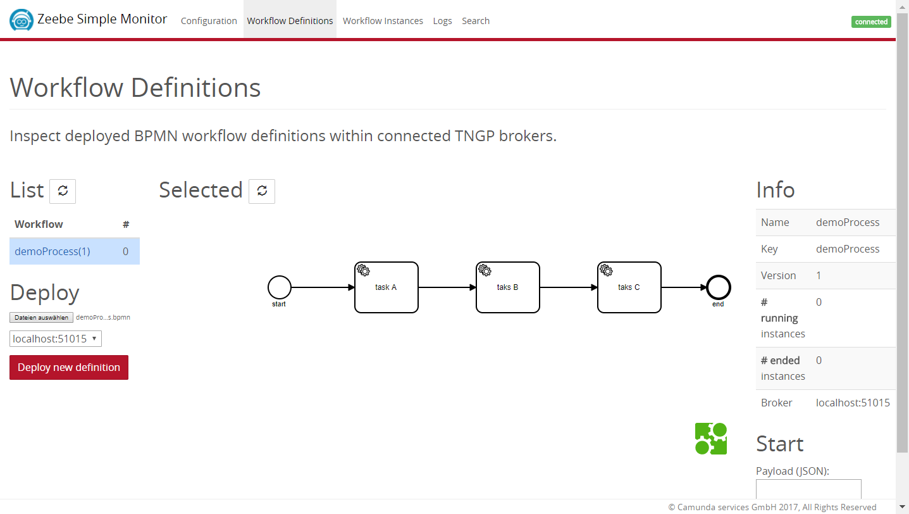
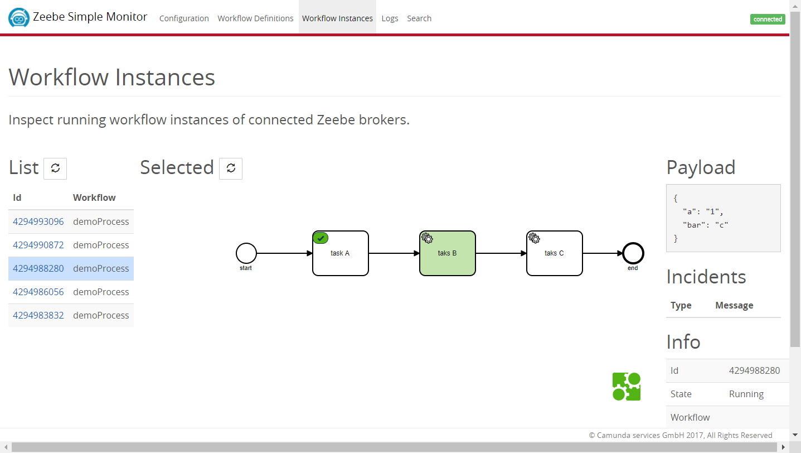
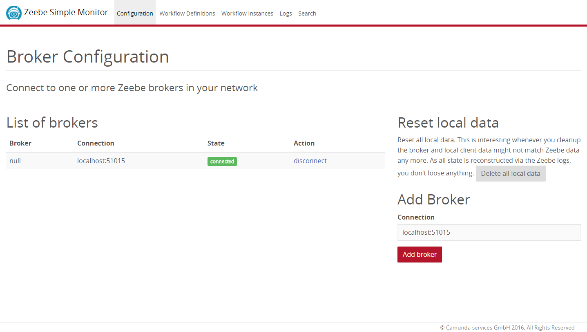
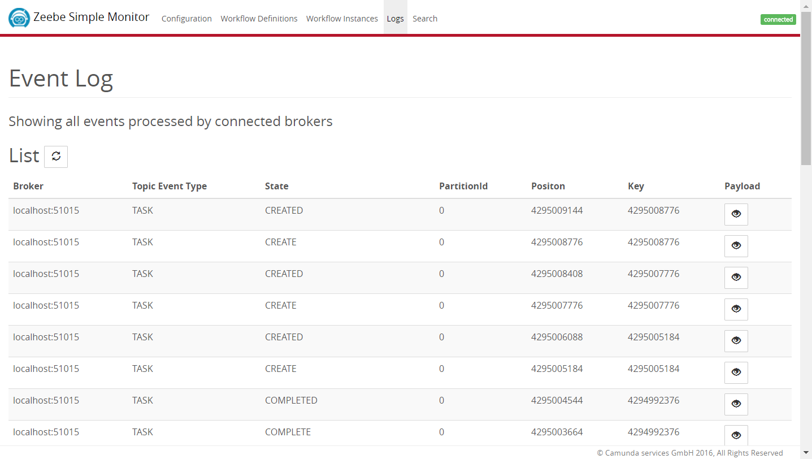

Simple monitor showing Zeebe information
=========================

This Spring Boot application can connect to [Zeebe](https://zeebe.io) and registers for all events handled on the broker. It projects them into some own JPA entities locally in order to be displayed in a small HTML5 web application.

**This is a hobby project meant for playing around with Zeebe. It is NOT meant to be used in production. There are no severe tests and no gurantees!**

## How to build

Build with Maven

`mvn clean install`

## How to run

Execute the (Fat) JAR file via

`java -jar target/zeebe-simple-monitor.jar`

Open a web browser and go to http://localhost:8080

## Impressions

You can connect to Zeebe brokers if you can reach them via network.

and see all events

