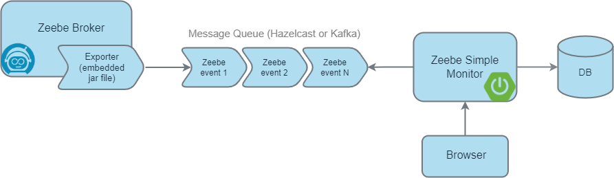

Zeebe Simple Monitor
=========================

[](https://github.com/camunda-community-hub/community)
[](https://github.com/Camunda-Community-Hub/community/blob/main/extension-lifecycle.md#stable-)
[](https://opensource.org/licenses/Apache-2.0)

[](https://github.com/camunda-community-hub/community/blob/main/extension-lifecycle.md#compatiblilty)
[](https://github.com/camunda-community-hub/community/blob/main/extension-lifecycle.md)

A monitoring application for [Zeebe](https://zeebe.io). It is designed for developers to

* get in touch with Zeebe and workflow execution (BPMN)
* test workflows manually
* provide insides on how workflows are executed 

The application imports the data from Zeebe using the [Hazelcast exporter](https://github.com/camunda-community-hub/zeebe-hazelcast-exporter). It aggregates the data and stores it into a (in-memory) database. The data is displayed on server-side rendered HTML pages.



## Install

### Upgrading from a prior version

See the [upgrade instructions](./UPGRADE.md).

### Docker

The docker image for the worker is published to [GitHub Packages](https://github.com/orgs/camunda-community-hub/packages/container/package/zeebe-simple-monitor).

```
docker pull ghcr.io/camunda-community-hub/zeebe-simple-monitor:2.4.1
```

* ensure that a Zeebe broker is running with a [Hazelcast exporter](https://github.com/camunda-community-hub/zeebe-hazelcast-exporter#install) (>= `1.0.0`)  
* configure the connection to the Zeebe broker by setting `zeebe.client.broker.gateway-address` (default: `localhost:26500`) 
* configure the connection to Hazelcast by setting `zeebe.client.worker.hazelcast.connection` (default: `localhost:5701`)
* forward the Hazelcast port to the docker container (default: `5701`)
* if you want to set the Hazelcast clusterName then you need to adjust the Zeebe broker and the Zeebe Simple Monitor alike
  * Hint: this is useful, e.g. when you want to adjust the ringbuffer's size in the Hazelcast cluster (the name is relevant) 
  * a) in Zeebe broker, set the environment variable `ZEEBE_HAZELCAST_CLUSTER_NAME=dev` (default: `dev`)
  * b) in Zeebe Simple Monitor, change the setting `zeebe.client.worker.hazelcast.clusterName` (default: `dev`)

If the Zeebe broker runs on your local machine with the default configs then start the container with the following command:  

```
docker run --network="host" ghcr.io/camunda-community-hub/zeebe-simple-monitor:2.4.1
```

For a local setup, the repository contains a [docker-compose file](docker/docker-compose.yml). It starts a Zeebe broker with the Hazelcast exporter and the application. 

```
mvn clean install -DskipTests
cd docker
docker-compose --profile in-memory up
```

Go to http://localhost:8082

To use PostgreSQL instead of the in-memory database, use the profile `postgres`. 

```
docker-compose --profile postgres up
```

### Manual

1. Download the latest [application JAR](https://github.com/zeebe-io/zeebe-simple-monitor/releases) _(zeebe-simple-monitor-%{VERSION}.jar
)_

1. Start the application
	`java -jar zeebe-simple-monitor-{VERSION}.jar`

1. Go to http://localhost:8082

### Configuration

The application is a Spring Boot application that uses the [Spring Zeebe Starter](https://github.com/zeebe-io/spring-zeebe). The configuration can be changed via environment variables or an `application.yaml` file. See also the following resources:
* [Spring Zeebe Configuration](https://github.com/zeebe-io/spring-zeebe#configuring-zeebe-connection)
* [Spring Boot Configuration](https://docs.spring.io/spring-boot/docs/current/reference/html/spring-boot-features.html#boot-features-external-config)

By default, the port is set to `8082` and the database is only in-memory (i.e. not persistent).

```
zeebe:

  client:
    broker.gateway-address: 127.0.0.1:26500
    security.plaintext: true
    
    worker:
      hazelcast:
        connection: localhost:5701
        clusterName: dev
        connectionTimeout: PT30S

spring:

  datasource:
    url: jdbc:h2:mem:zeebe-monitor;DB_CLOSE_DELAY=-1
    username: sa
    password:
    driverClassName: org.h2.Driver

  jpa:
    database-platform: org.hibernate.dialect.H2Dialect
    hibernate:
      ddl-auto: update

server:
  port: 8082
  servlet:
    context-path: /
  allowedOriginsUrls: ""
```

#### Change the Context-Path

The context-path or base-path of the application can be changed using the following property:

``` 
server:
  servlet:
    context-path: /monitor/
```

It is then available under http://localhost:8082/monitor.

#### Cross Origin Requests

To enable Simple Monitor to send CORS header with every HTTP response,
add the allowed origins (`;` separated) in the following property:

``` 
server:
  allowedOriginsUrls: http://localhost:8082;https://monitor.cloud-provider.io:8082
```

This will then set ```Access-Control-Allow-Origin``` headers in every HTTP response.

#### Customize the Look & Feel

You can customize the look & feel of the Zeebe Simple Monitor (aka. white-labeling). For example, to change the logo or
alter the background color. The following configurations are available:

```
- white-label.logo.path=img/logo.png
- white-label.custom.title=Zeebe Simple Monitor
- white-label.custom.css.path=css/custom.css
- white-label.custom.js.path=js/custom.js
```

#### Change the Database

For example, using PostgreSQL:

* change the following database configuration settings

```
- spring.datasource.url=jdbc:postgresql://db:5432/postgres
- spring.datasource.username=postgres
- spring.datasource.password=zeebe
- spring.datasource.driverClassName=org.postgresql.Driver
- spring.jpa.properties.hibernate.dialect=org.hibernate.dialect.PostgreSQLDialect
```

* the PostgreSQL database driver is already bundled 

See the [docker-compose file](docker/docker-compose.yml) (profile: `postgres`) for a sample configuration with PostgreSQL. 

The configuration for using MySql is similar but with an additional setting for the Hibernate naming strategy:

```
- spring.datasource.url=jdbc:mysql://db:3306/simple_monitor
- spring.datasource.username=root
- spring.datasource.password=zeebe
- spring.datasource.driverClassName=com.mysql.cj.jdbc.Driver
- spring.jpa.properties.hibernate.dialect=org.hibernate.dialect.MySQLDialect
- spring.jpa.hibernate.naming.physical-strategy=org.hibernate.boot.model.naming.PhysicalNamingStrategyStandardImpl
```

* the MySql database driver is already bundled

See the [docker-compose file](docker/docker-compose.yml) (profile: `mysql`) for a sample configuration with MySql.

## Code of Conduct

This project adheres to the Contributor Covenant [Code of
Conduct](/CODE_OF_CONDUCT.md). By participating, you are expected to uphold
this code. Please report unacceptable behavior to code-of-conduct@zeebe.io.

## License

[Apache License, Version 2.0](/LICENSE)

## About


