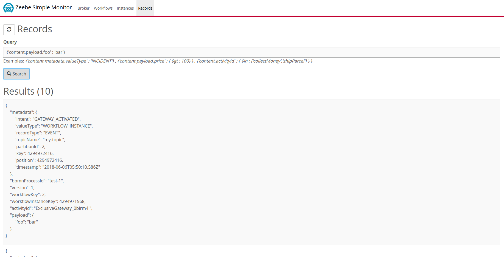

Zeebe Simple Monitor
=========================

This Spring Boot application connects to [Zeebe](https://zeebe.io) and receive all data (i.e. records). It aggregates the data and store it locally in MongoDB. The aggregated data can be displayed in a small HTML5 web application.

**Features:**
* inspect deployed workflows
* inspect workflow instances, including payload and incidents
* inspect raw records (events/commands) and search
* management operations (e.g. new deployment, cancel workflow instance, update payload)

*This is a community project meant for playing around with Zeebe. It is not officially supported by the Zeebe Team (i.e. no gurantees). Everybody is invited to contribute!* 

## How to build

Build with Maven

`mvn clean install`

## How to run

> [Install and launch MongoDB](http://docs.mongodb.org/manual/installation/)

Execute the (Fat) JAR file via

`java -jar target/zeebe-simple-monitor-{VERSION}.jar`

Open a web browser and go to http://localhost:8080

## Impressions

## Code of Conduct

This project adheres to the Contributor Covenant [Code of
Conduct](/CODE_OF_CONDUCT.md). By participating, you are expected to uphold
this code. Please report unacceptable behavior to code-of-conduct@zeebe.io.

## License

Most Zeebe source files are made available under the [Apache License, Version
2.0](/LICENSE) except for the [broker-core][] component. The [broker-core][]
source files are made available under the terms of the [GNU Affero General
Public License (GNU AGPLv3)][agpl]. See individual source files for
details.

[broker-core]: https://github.com/zeebe-io/zeebe/tree/master/broker-core
[agpl]: https://github.com/zeebe-io/zeebe/blob/master/GNU-AGPL-3.0
